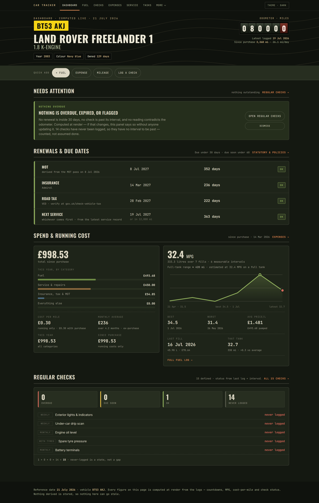
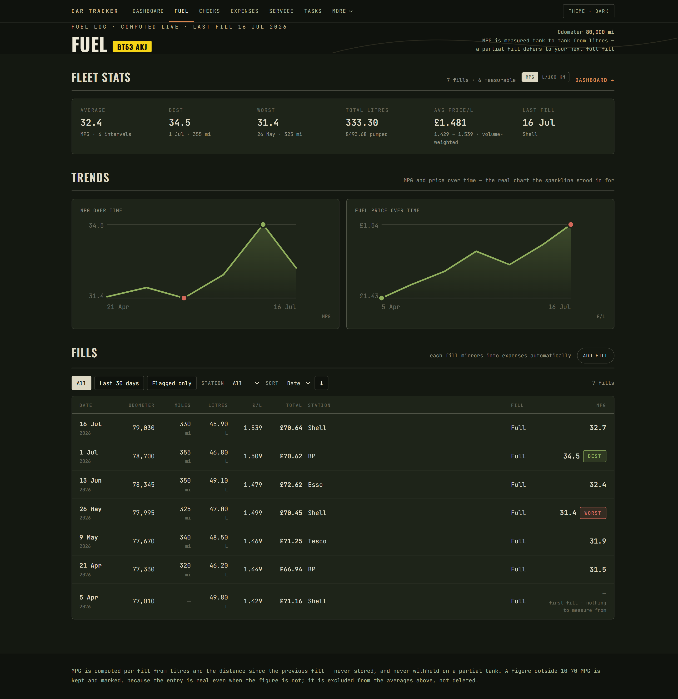
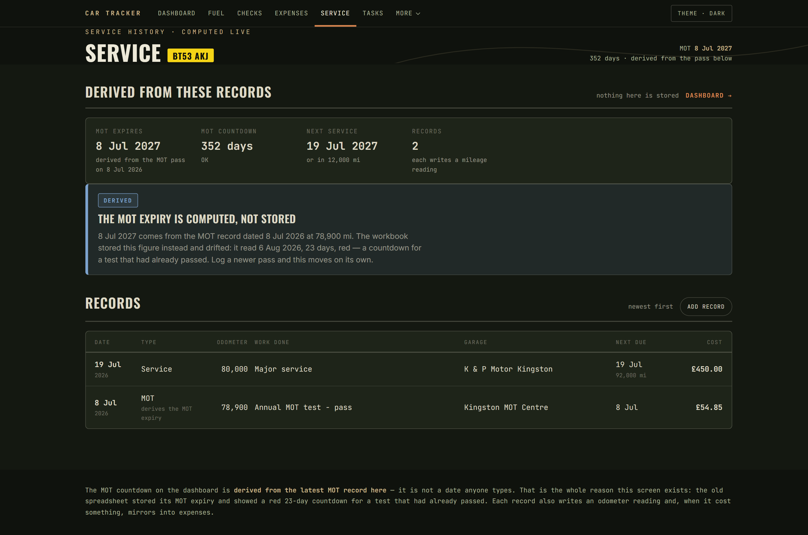
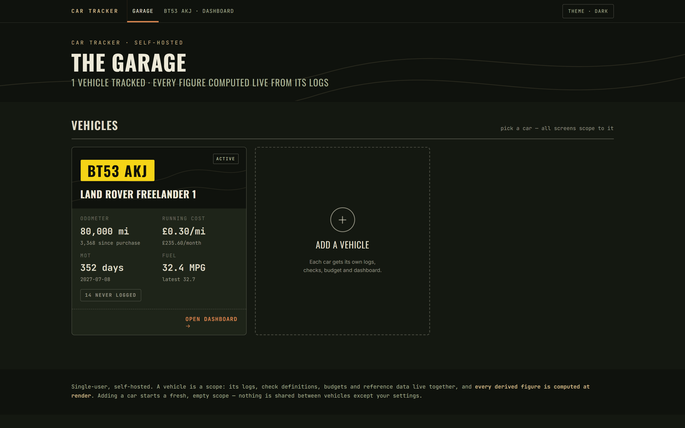

# Car Tracker

Personal self-hosted car tracked application with an MCP server allowing LLMs and agents to act as your car data and maintenance assistants:

## Tech

Containerised (docker compose), Azure Aspire and self-hosted ready. .NET10 on the backend, PostgreSQL, React on the front-end, modern .NET with Microsoft Agent Framework.

- src/CarTracker.WebApp - pure vite react app
- src/CarTracker.WebApi - Web API
- src/CarTracker.Gateway - YARP reverse proxy; the single public origin (DEC-009)
- src/CarTracker.Data - EF Core data model and migrations
- src/CarTracker.ModelContextProtocol - MCP server and protocol definition
- src/CarTracker.Shared - shared types and helpers
- src/CarTracker.Domain - domain logic and derived metrics
- src/CarTracker.ServiceDefaults - OpenTelemetry, health checks, service discovery, HTTP resilience
- src/CarTracker.AppHost - aspire host wiring the dependencies up
- docs/ - current documentation
- archive/ - original artifacts and design concepts

## Features

- Track your car's maintenance and service history
- Get reminders for upcoming maintenance tasks
- Generate reports on your car's performance and expenses
- Integrate with LLMs and agents for intelligent assistance and recommendations
- Containerized deployment for easy setup and scalability
- Self-hosted option for privacy and control over your data
- Modern web application built with React and .NET10 for a seamless user experience

## Screenshots

Desktop, showing the sample vehicle (BT53 AKJ). Every figure on every screen is computed live from the logs -
nothing derived is stored. A phone-oriented walkthrough with mobile captures lives in
[`docs/guide/USER-GUIDE.md`](docs/guide/USER-GUIDE.md).

**Dashboard - what needs you today, and what the car has cost**

**Fuel log - tank-to-tank MPG, price trends, and the fills table**

**Service history - the MOT expiry is derived from the logged pass, never a stored date**

**The garage - the multi-vehicle home screen**

## Specification

## 1. Goals and principles

- Multiple vehicles are first-class: every record is scoped to a vehicle, the home screen is the garage, and one vehicle is the designated default for assistant calls that don't name one.
- Every derived number in the current Dashboard must be computed server-side, never stored stale.
- Fast data entry from a phone (fuel fill-ups, marking a check done, logging a wash) is the primary daily use case.
- The MCP server exposes the same domain, so the assistant always reads live data and can log entries conversationally.
- The existing spreadsheet's history is entered through the MCP write tools by an agent, not by a bespoke importer (DEC-008). The workbook stays in `archive/` as the reference for those figures.

---

## 2. Data model (entities)

- **Vehicle** - static reference: identity (reg, make, model, year, colour, body, VIN if added), purchase (date, seller, price, purchase mileage), engine/drivetrain, fluids and specs (oil spec/capacity, coolant OAT spec/capacity, brake fluid, transmission oil, plugs, filter part numbers), tyre specs (size, pressures normal/full load front/rear, min tread), statutory (MOT expiry, VED cost, ULEZ status), insurance block (insurer, policy number, period, type, premium, excesses, NCB), breakdown cover, garage details, lifecycle status (Active / Sold / SORN), and a single default-vehicle flag - the assistant's fallback when no vehicle is named.
- **MileageReading** - dedicated log of odometer readings with timestamp and source (manual, fuel, tyre, wash, service). "Current mileage" is derived as the max/most-recent reading. This decouples mileage from any single log.
- **ExpenseEntry** - date, category (enum: Fuel, Service, Repair, Parts, Insurance, Tax, MOT, Wash, Parking, Tools/Equipment, Breakdown, Purchase, Misc), sub-category, vendor, amount, mileage, payment method, notes. Running total is computed, not stored.
- **FuelEntry** - date, mileage, litres, price/L, total (derive from litres x price or store both and validate), station, fill level (full/half/quarter). Derived: miles since last, MPG (UK), L/100km. Should optionally auto-create a linked ExpenseEntry (category Fuel) to avoid double entry.
- **ServiceRecord** - date, mileage, type, garage, work done, parts replaced, cost, next due (miles), next due (date), notes.
- **Task** - unified table with a `TaskKind` discriminator for **DIY** vs **Workshop** (they share most fields): priority (High/Medium/Low), title, description, est. cost, status (Open/In Progress/Scheduled/Done), target date or target service, completed date, assigned garage (workshop only), notes.
- **CheckDefinition** - the recurring inspection: name, cadence label, interval (days), guidance/notes.
- **CheckLog** - each time a check is performed: check definition, date done, result/notes. "Next due" and "status" (OK / Due soon / Overdue) are computed from last CheckLog + interval.
- **TyreReading** - date, mileage, PSI x5 (FL/FR/RL/RR/spare), tread mm x4, location/tool, notes.
- **WashEntry** - date, location, type, cost, mileage, notes.
- **BudgetCategory** - category, annual budget. YTD actual, remaining, % used all derived from ExpenseEntry for the current calendar year.
- **Issue** (watchlist) - issue, severity (Critical/Medium/Low), first noted, last checked, current observation, action if worsens, est. cost to fix, status (Monitoring/Resolved).
- **EquipmentItem** - item, category, purchased date, source, cost, where stored, status (Owned/On order/To order), notes.
- **Document** - uploaded files (V5C slip, insurance certificate/schedule, MOT certificate, receipts, photo sets). Metadata: type, title, date, linked entity (optional), file blob or path. The project already has PDFs and photos that belong here.

Reference lists (expense categories, check cadences, garages) should be seed data, editable in settings.

---

## 3. Core web features

### 3.0 Garage (home)

- Landing screen: one card per vehicle - reg plate, name, status badge (Active / Sold / SORN), current mileage, and an attention summary (overdue/due-soon counts, next renewal with day count).
- Add-car flow: the vehicle form plus a choice of where its regular checks come from - start empty, a generic starter set, or copy from an existing vehicle.
- Sold/SORN vehicles keep their history and stay browsable, but are visually parked and excluded from attention noise.
- Switching cars is navigation (the vehicle lives in the URL), not hidden session state.

### 3.1 Dashboard (per-vehicle home)

Recreate every computed value from the current Dashboard sheet, live:

- Vehicle status: registration, current mileage, latest logged mileage, miles since purchase.
- Renewals and due dates with day-countdowns: MOT expiry, insurance expiry, road tax expiry, next service target (date and miles). Colour-code by proximity (e.g. red < 30 days, amber < 60).
- Spend YTD by group (fuel; service and repairs; insurance + tax + MOT) plus total since purchase, monthly average, and cost-per-mile since purchase.
- Fuel economy: average / best / worst MPG, total litres, avg price/L, last fill date.
- Action items: open DIY count, open workshop count, high-priority open count, open issues count, in-progress and scheduled counts.
- Regular checks status: overdue / due soon / OK counts, last wash, days since last wash, last tyre check.

### 3.2 Logs (CRUD, table + quick-add)

Each of these gets a filterable, sortable table and a mobile-friendly quick-add form:

- Expenses, Fuel, Service history, Tyre readings, Wash log, Mileage readings.
- Fuel quick-add should compute MPG on the fly and warn on outliers (e.g. MPG suspiciously high/low suggests a missed fill or wrong mileage).

### 3.3 Tasks (DIY + Workshop)

- Kanban or grouped-by-status view. Filter by kind, priority, status.
- "Bundle for next garage visit" view that lists open workshop tasks with a summed estimated cost, ready to send to the garage.
- Convert a completed workshop task into a ServiceRecord in one click.

### 3.4 Regular checks

- List with computed status per check (OK / due soon / overdue) and next-due date.
- "Mark done today" button that creates a CheckLog and optionally captures a result note. Batch "mark all weekly checks done" for the walk-around routine.

### 3.5 Budget

- Category table: annual budget (editable), YTD actual (derived), remaining, % used, over-budget highlighting. Per-mile budgeted cost. Period toggle (calendar year vs rolling 12 months vs since purchase).

### 3.6 Issues watchlist

- Severity-sorted list, edit current observation and last-checked inline. Worst-case total cost. Filter Monitoring vs Resolved.

### 3.7 Equipment inventory

- Table with owned / on-order / to-order totals. "To order" items feed a shopping shortlist.

### 3.8 Vehicle info / settings

- Editable static reference. Manage expense categories, check definitions, garages, budget targets. This is where fluid specs and tyre pressures live for quick reference at the pump or wash.

### 3.9 Documents

- Upload and tag PDFs and photos (insurance docs, V5C, MOT certs, receipts, condition photo sets). Link to a service record, expense, or issue. Simple viewer/download.

---

## 4. Derived logic and reminders engine

Centralise these calculations in one service so both the web UI and MCP server use identical logic:

- Current mileage = latest MileageReading.
- Per-fuel-entry MPG, L/100km, miles since last.
- Fleet MPG stats (avg/best/worst), total litres, avg price/L.
- Spend rollups by category and group, running totals, cost-per-mile, monthly average.
- Days-to-renewal for MOT / insurance / tax / service (date and mileage based).
- Check status from last CheckLog + interval.
- Budget YTD actual and variance.

**Reminders / notifications (phase 1.5):**

- A background job (Hosted Service / cron) that flags: MOT/insurance/tax within N days, service due by date or mileage, checks overdue, wash cadence exceeded (target every 3-4 weeks), tyre check overdue.
- Delivery options, pick per your setup: email, ntfy/Gotify push, or just a badge count in the UI. Keep the channel pluggable.

---

## 5. MCP server (the key differentiator)

Expose the domain as MCP tools so the assistant always reads live data and can log on your behalf. Host in-process in the same ASP.NET Core app.

### 5.1 Transport and auth

- HTTP/SSE transport (so it is reachable remotely from the Claude app), protected by a bearer token or mTLS. Do not expose it unauthenticated.
- Consider a read-only token and a read-write token so casual "what's my MPG" access can't mutate data.

### 5.2 Read tools

Every tool takes an optional `vehicle` (registration or id). Omitted, it resolves to the designated default
vehicle; an ambiguous or unknown name is an error, never a guess.

- `list_vehicles` - reg, name, status, default flag, current mileage - so the assistant can disambiguate naturally.
- `get_vehicle_summary` - reg, current mileage, miles since purchase, next renewals with day counts.
- `get_fuel_status` - last fill, avg/best/worst MPG, avg price/L, estimated range remaining on current tank.
- `get_spend_summary` - YTD and since-purchase totals by category, cost-per-mile, budget variance.
- `get_due_items` - overdue/soon checks, upcoming renewals, service due, open high-priority tasks. This is the "what needs my attention" call.
- `get_open_tasks` - DIY and workshop tasks, filterable by kind/priority/status.
- `get_issues` - watchlist with severity and current observation.
- `get_check_status` - per-check due status.
- `get_reference` - fluid specs, tyre pressures, part numbers, garage contact (so the assistant can answer "what oil does it take" or "what pressure for a full load").
- `search_documents` / `get_document_metadata` - list/tag lookup (not the file bytes over MCP unless you want it).

### 5.3 Write tools (guarded, read-write token only)

Write tools take the same optional `vehicle` parameter with the same default-vehicle fallback.

- `log_fuel_fillup` - date, mileage, litres, price/L, station, fill level. Returns computed MPG. Auto-mirrors to expenses.
- `log_expense` - category, amount, vendor, mileage, notes.
- `update_mileage` - quick odometer update.
- `mark_check_done` - check name + optional result note.
- `add_task` - kind, priority, title, description, est cost.
- `complete_task` - id + completed date, optional promote-to-service-record.
- `log_wash`, `log_tyre_reading` - as per their tables.
- `add_issue_observation` - update last-checked and current observation on a watchlist item.

**MCP design notes:**

- Tool descriptions should be explicit and example-rich so the model calls them correctly.
- Return structured JSON plus a short human summary string.
- Validate mileage monotonicity and flag anomalies rather than silently accepting them.
- Log every write with source = "mcp" for auditability.

---

## 6. Non-functional

- **Getting history in:** no importer (DEC-008). The existing `.xlsx` history is entered through the MCP write tools by an agent once those exist, supervised against the workbook in `archive/`. The five figures its Dashboard gets wrong (DEC-012) are preserved as a hand-authored test fixture for the derived-metrics service, which is where their value always was.
- **Backup:** if SQLite, a scheduled copy of the DB file + documents to a second location. If Postgres, `pg_dump` on a timer. One-click export back to Excel/CSV is a nice safety net and keeps parity with the old workflow.
- **Auth:** single user. A static API key (`ApiKey:Value`, sent as `X-Api-Key`) protects every `/api` route except `/api/meta`, which stays open so the front-end can tell "no key set" from "API down" (DEC-009). The MCP server's read-only / read-write scoped tokens (§5.1) are a separate mechanism arriving in Phase 4. Cookie auth or reverse-proxy auth (e.g. Authelia), and ASP.NET Identity for family access, remain the growth path - not the near-term plan.
- **Topology:** `CarTracker.Gateway` is the single public origin: the React app on `/`, the API on `/api`, Scalar on `/scalar`. Identical in development and on the NAS, so **CORS is never needed** (DEC-009).
- **Deployment:** `docker-compose` with gateway + API + Postgres. Config via environment variables. HTTPS mandatory since the MCP endpoint carries a token.
- **Audit trail:** created/updated timestamps and source on all mutable entities.
- **Testing:** unit tests on the derived-metrics service (MPG, cost-per-mile, due-date logic) since that is where correctness matters most.

---

## 7. Suggested build order

1. Data model + EF Core + migrations.
2. Derived-metrics service (with unit tests) - the shared brain.
3. Web CRUD for the daily logs (fuel, expense, checks, mileage) + Dashboard.
4. Remaining logs, tasks, budget, issues, equipment, vehicle info, documents.
5. Reminders background job + chosen notification channel.
6. MCP server: read tools first, then guarded write tools, then remote auth.
7. Backup/export + Docker packaging.

---

## 8. Phase 2 / nice-to-haves

- Fuel price and MPG trend charts; spend-over-time charts.
- DVLA/MOT lookup integration to auto-refresh MOT and tax expiry from the reg.
- Barcode/receipt photo capture that pre-fills an expense.
- Estimated range on current tank surfaced on the dashboard, not just via MCP.
- Service-interval templates so "next due" is suggested automatically.
