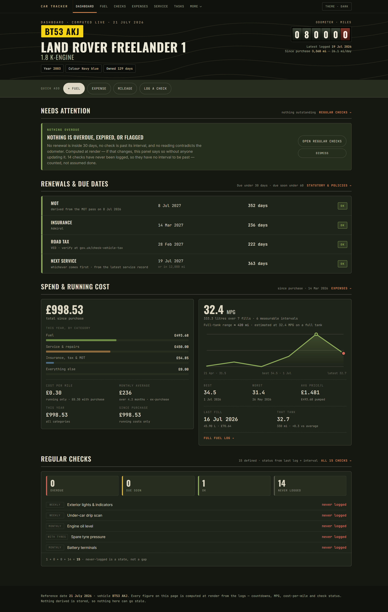
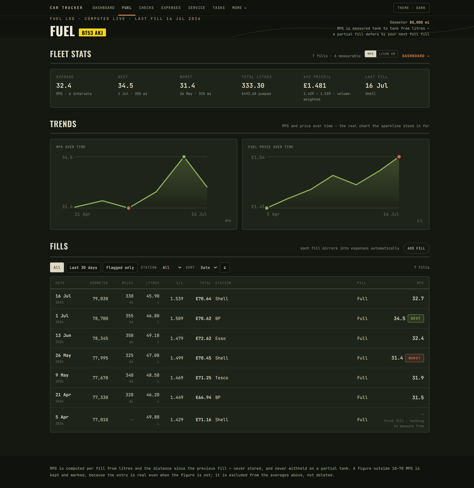
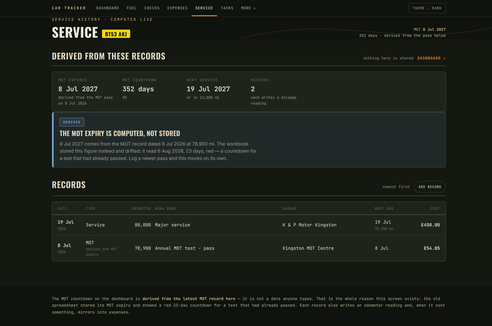
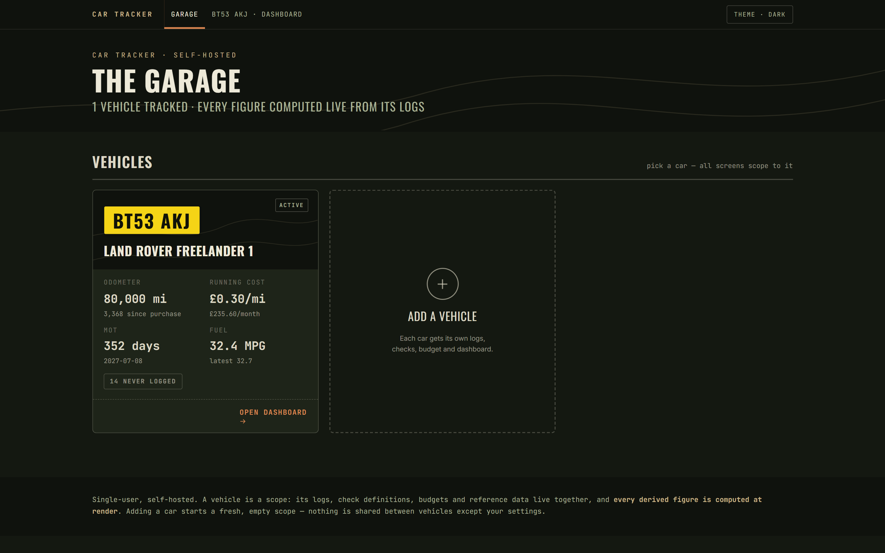

# Cambelt

A maintenance and cost tracker for the cars you actually own, with an MCP server so an AI
assistant can read the same live data and log entries on your behalf.

> The product is **Cambelt**; the code is `CarTracker`. Namespaces, image names, the database, the Auth0
> audience and the localStorage key all keep the original name deliberately - none of it is visible to a user
> and each rename costs something real, from invalidated access tokens to silently reset preferences. See
> `docs/specs/2026-08-11-cambelt-azure-deployment/sub-specs/technical-spec.md` for the full list and the price
> of each.

## Screenshots

Desktop, showing the sample vehicle. Every figure on every screen is computed live from the logs -
nothing derived is stored. A phone-oriented walkthrough with mobile captures lives in
[`docs/guide/USER-GUIDE.md`](docs/guide/USER-GUIDE.md).

**Dashboard - what needs you today, and what the car has cost**



**Fuel log - tank-to-tank MPG, price trends, and the fills table**



**Service history - the MOT expiry is derived from the logged pass, never a stored date**



**The garage - the multi-vehicle home screen**



## Quickstart

### Prerequisites

- **.NET SDK 10.0.301** or a later patch. `global.json` pins it with `rollForward: latestPatch`
- **Node 22** for the Vite app (what CI uses; nothing in `package.json` pins it).
- **Docker Desktop**, for `dotnet test` only. Running the app does not need it - Aspire starts its own
  Postgres container, but the test suite is what genuinely requires a working Docker daemon.

### First run

```bash
dotnet run --project src/CarTracker.AppHost   # everything; app on http://localhost:5080
dotnet build
dotnet test          # needs Docker - Testcontainers starts a real PostgreSQL 18
```

Aspire brings up Postgres, the API, the gateway and the Vite dev server together, and the WebApi applies
migrations on startup in Development. The gateway is the single origin - open **http://localhost:5080**, not
the API or the Vite port. The Aspire dashboard is on http://localhost:15080.

**A fresh clone needs no secrets.** Everything has a committed default: the dev API key and the Auth0
authority/audience in `src/CarTracker.WebApi/appsettings.json`, the SPA's matching Auth0 values as code
fallbacks in `src/CarTracker.WebApp/src/lib/authConfig.ts`, and the local Postgres password in
`src/CarTracker.AppHost/appsettings.Development.json`. Sign in through Auth0 and you land on an empty garage -
add a vehicle, and every screen fills in from what you log.

Tests run against real PostgreSQL via Testcontainers, applying the real migrations. Not the in-memory
provider, which ignores column types, check constraints and FK behaviour - i.e. most of what the schema
asserts.

### Configuration

Nothing below is required. Each key either has a committed default or degrades to a designed off-state, which
is why the clone-and-run above works with no setup.

| Setting | Default | What it does |
|---|---|---|
| `ApiKey:Value` | `dev-api-key`, committed | Fronts only the anonymous meta and docs endpoints; grants no vehicle access. Signing in via Auth0 is the way in (§6) |
| `Auth0:Authority` / `Auth0:Audience` | committed | Token validation. Neither is a secret - the audience is a public identifier, the authority a discovery origin |
| `VITE_AUTH0_DOMAIN` / `_CLIENT_ID` / `_AUDIENCE` | code fallback | Set only to point the SPA at a different tenant; see `src/CarTracker.WebApp/.env.example` |
| `Documents:RootPath` | `documents-data` under the content root | Where uploaded document bytes live (DEC-005) |
| `Reminders:Interval` | 24 hours | How often the background reminder sweep wakes |
| `ApplyMigrationsOnStartup` | ignored in Development | Brings the schema forward on boot in production |
| `CARTRACKER_CONNECTION` | a localhost fallback | Design-time only, for `dotnet ef database update --project src/CarTracker.Data` |
| `Lookup:*` | unset | DVLA/DVSA registration lookup - off by default, see below |
| `Signup:AllowedEmails` / `Signup:AllowedDomains` | unset | Who may create an account. **Unset means closed**, see below |
| `Auth0:Management:ClientId` / `ClientSecret` | unset | M2M credential for reading a login's real email address, and for erasing it. **Unset closes sign-up and refuses account deletion**, see below |
| `IdentityDeletion:RetryInterval` | 1 hour | How often queued identity deletions are retried |
| `Ownership:ClaimUnownedVehiclesFor` | unset | The one Auth0 subject allowed to adopt vehicles with no owner. Unset means never |

### Who may sign up - an empty allowlist means closed

Signing in is Auth0's; **having an account here is not**. The first time a validated token arrives for a
subject the app has never seen, the address behind it is checked against `Signup:AllowedEmails` (exact
addresses) and `Signup:AllowedDomains` (everyone at a domain), both comma-separated. Not on either list means
no `User` row is created at all and the request is refused with a `403` carrying the problem type
`signup-not-invited`, which the client renders as "not yet invited" rather than a generic error.

**The tenant must have verified the address, and the list alone is not the gate.** On a database connection
anyone may self-register with any address they can type, so `Signup:AllowedDomains=example.com` on its own
would admit whoever registers as `anything@example.com` - a deployment that reads as invitation-only and is
open to the internet. An address is a claim until Auth0's `email_verified` says the person followed the link
in it (a social connection asserts it instead). A connection that never verifies addresses therefore admits
nobody, whatever is on the list.

**Both unset - the state of a fresh clone - admits nobody new.** That is the fail-safe direction and the
opposite of the natural reading, so it is worth saying twice: an unconfigured deployment is a *closed* one, not
an open one. Existing accounts are never re-checked, so tightening or emptying the list shuts the door on
newcomers without evicting anyone already inside.

Three consequences worth knowing before pointing this at the internet:

- **The address comes from Auth0's Management API, not from the token.** This tenant's access tokens carry
  `sub` and nothing else, so the app asks the tenant who `auth0|68a…` is - and whether that address is
  verified, which travels in the same answer. Without `Auth0:Management:ClientId`/`ClientSecret` (an M2M
  application with the `read:users` grant) no address can be resolved, and an address that cannot be read is on
  no list - so **an unconfigured Management API is also a closed door**, whatever the allowlist says.
- **Being refused is remembered for a minute.** A refusal writes no row, by design, so nothing would otherwise
  stop an uninvited visitor's browser asking the tenant again on every request it makes - and the Management
  API is rate-limited, so that traffic ends up refusing whichever *invited* newcomer signs in while it is
  throttled. The cache holds refusals only, never admissions: at worst someone newly invited (or newly
  verified) waits a minute. Adding them to the allowlist is a restart anyway, which empties it.
- **A refused person still has an Auth0 identity.** They signed up with the tenant; they simply have no account
  here. Nothing leaks, and there is nothing to clean up locally, but the tenant will accumulate identities that
  were never admitted. Turning off public sign-up in the Auth0 dashboard is the belt to this braces, and it is
  a dashboard action rather than a setting here.

```bash
dotnet user-secrets --project src/CarTracker.WebApi set "Signup:AllowedDomains" "example.com"
dotnet user-secrets --project src/CarTracker.WebApi set "Auth0:Management:ClientId"     "..."
dotnet user-secrets --project src/CarTracker.WebApi set "Auth0:Management:ClientSecret" "..."
```

In containers these are environment variables with double underscores (`Signup__AllowedDomains`,
`Auth0__Management__ClientId`); see [`deploy/.env.example`](deploy/.env.example), which also flags the polarity
trap - a blank `Lookup__*` means that feature is off, a blank `Signup__*` means the door is shut.

### Taking your data out, and destroying an account

`GET /api/account/export` answers with everything the signed-in account owns as raw rows - UK GDPR Art. 15 and
Art. 20 in one file. It contains **no calculated figure**: every number the app displays is worked out at read
time from these rows and never stored, and an export carrying stored derived values would reproduce in the
archive exactly the defect the spreadsheet's five wrong dashboard figures document. Document *files* are not
included, only their details and the path each refers to. The file says both of these about itself, in a
`notes` array, because an absence is otherwise indistinguishable from an oversight.

`DELETE /api/account` destroys the account, its vehicles and everything under them, its reference lists, its
assistant tokens, the document bytes on the volume, and the Auth0 login behind it. The body must repeat the
account's own email address; the UI asks for it too, but the client is not the only possible caller.

**With `Auth0:Management:` unset it refuses with a `503` and deletes nothing.** The same credential that reads
an address erases it, and it needs the `delete:users` grant as well as `read:users`. The alternative - deleting
all the local data and leaving a working sign-in behind - is the worst of both outcomes and would be silent, so
the check happens before the transaction opens. The client hides the control entirely when `GET /api/meta`
reports `identityDeletionConfigured: false`, rather than offering a button that cannot work.

The local data goes first and Auth0 second, because every other ordering can strand a person's data behind a
login they no longer have. The cost is that a failed call leaves a live login with nothing behind it; that
failure is written to `pending_identity_deletions` and retried on `IdentityDeletion:RetryInterval` until the
tenant agrees, so it is a delay rather than an outcome.

`Ownership:ClaimUnownedVehiclesFor` belongs to the same story. Vehicles created before multi-user have no
owner, and exactly one identity - named here as an `auth0|…` subject - may inherit them when it is provisioned.
Unset means no adoption ever, which replaces the earlier "whoever signs in first claims every unowned vehicle"
rule: sound while the deployment had one user and a trap the moment a stranger can sign in first.

### Optional: DVLA / MOT registration lookup

The add-car sheet can turn a registration into make, colour, year, engine size, fuel type, tax status and the
current MOT expiry, so a plate replaces most of the form. **It ships dormant.** Both upstreams need
credentials that no checkout has, so with none set the endpoint answers `503 NotConfigured` (deliberately not
502, which would invite a retry that cannot succeed), the sheet says so, and manual entry stays exactly as
usable. That is the state of a fresh clone and of CI.

Two independent registrations, because they are two services with different auth:

- **DVLA Vehicle Enquiry Service** - register at
  <https://register-for-ves.driver-vehicle-licensing.api.gov.uk/>. Approval is manual and the key arrives by
  email. This gives you `Lookup:VesApiKey`, and it is the only one that gates the feature: identity, engine
  and tax all come from VES.
- **DVSA MOT History** - registration is at `documentation.history.mot.api.gov.uk` *(unverified - confirm the
  current address before relying on it)*. One registration yields all four values: an API key, a `client_id`,
  a `client_secret` and an OAuth token endpoint. This adds only the MOT expiry seed.

**VES alone is enough.** The feature switches on with `VesApiKey` set and treats the MOT half as independently
optional, so a lagging DVSA approval does not block anything - you get every field except the MOT seed, and
that countdown starts on the first logged pass anyway, which is the ordinary path.

Locally, the keys go in user-secrets on the WebApi. The AppHost forwards no environment variables, so this is
the only local path:

```bash
dotnet user-secrets --project src/CarTracker.WebApi set "Lookup:VesApiKey"      "..."
# the MOT half, optional and all-or-nothing:
dotnet user-secrets --project src/CarTracker.WebApi set "Lookup:MotApiKey"      "..."
dotnet user-secrets --project src/CarTracker.WebApi set "Lookup:MotTokenUrl"    "https://login.microsoftonline.com/<tenant>/oauth2/v2.0/token"
dotnet user-secrets --project src/CarTracker.WebApi set "Lookup:MotClientId"    "..."
dotnet user-secrets --project src/CarTracker.WebApi set "Lookup:MotClientSecret" "..."
```

Never `appsettings.json` - it is committed. In containers the same settings are environment variables with a
double underscore (`Lookup__VesApiKey`); see [`deploy/.env.example`](deploy/.env.example) and
[`docs/deployment-synology.md`](docs/deployment-synology.md).

One caveat worth carrying into first live use: **the response mapping is written against the documented
shapes, not against real traffic**, and the DVSA token flow has never round-tripped. Expect to check field
names the first time a real key is in place (DEC-015 records this as a known risk rather than hiding it).

### The in-app assistant needs an Anthropic key

Same shape as the lookup above, same polarity: **absent means off.** With no `Chat:ApiKey` the chat endpoints
answer 503, `meta.chatConfigured` is false and the app renders no chat entry point at all - a control that
cannot work is not offered. That is the state of a fresh clone and of CI.

```bash
dotnet user-secrets --project src/CarTracker.WebApi set "Chat:ApiKey" "sk-ant-..."
```

The key comes from <https://platform.claude.com>. In containers it is `Chat__ApiKey` from `deploy/.env`.

Two settings bound the spend, and **their polarity is the third one in this file, so read it twice**:
`Chat:DailyTokensPerOwner` and `Chat:DailyTokensGlobal` are daily ceilings where **blank means the shipped
default** (1,000,000 and 5,000,000) and **an explicit `0` turns the chat off** for that scope. Every token the
model reports counts, cached prefix included, even though a cached one is billed at a tenth of list - the tool
catalogue is ~17k of that per turn, so the per-account figure is better read as *about sixty turns a day* than
as a quantity of conversation. It is a guard rail on volume, not an invoice. The ledger is a table
(`chat_usage`), not a counter in memory, because Watchtower recreates this container minutes after every CI
publish and an in-memory budget would hand out a fresh allowance each time.

`Chat:Model` defaults to `claude-sonnet-5`; set it to `claude-opus-5` to trade cost for accuracy on
photographed paperwork.

**What leaves the machine, stated plainly.** A chat message, the conversation it belongs to, and anything
attached to it are sent to Anthropic to be answered. That includes photographs of paperwork - an MOT
certificate carries a registration, a VIN and a garage's name, and a fuel receipt carries a place and a time.
Nothing else about the account is sent: the assistant reads the database through tools whose *results* travel,
not the database. **Attachments are never stored**: they reach the model and the response is prose, and the
bytes do not survive the request - filing a certificate is a separate, deliberate act on the documents screen.
The account-data export and the deletion endpoint shipped the same month as this; this paragraph is their
honest counterpart, because an export cannot recall what was sent to a processor.

### Gotchas that cost hours once

- **`ASPNETCORE_ENVIRONMENT` must be `Development` or user-secrets are not loaded.** A correct key returning
  401, or a lookup insisting it is unconfigured, is almost always this.
- **User-secrets override `appsettings.json`.** A stale secret silently shadows an edited committed value.
- **An unresolved Aspire parameter blocks on a dashboard modal, with nothing in stdout.** If the AppHost log
  stops after "Login to the dashboard" and never says "Distributed application started", open the dashboard -
  it is asking you a question.
- **Aspire resource logs go to the dashboard, not stdout.** The AppHost's own log is ~24 lines and tells you
  almost nothing; reading it and concluding "wedged" is a mistake worth not repeating.

## Deployment

The app ships as two containers and runs in **two modes from one compose file**. The difference is not a
different application, it is how much of the surrounding machine the app has to bring with it.

| | Standalone (Synology, any single box) | Shared host (Asgard, `cambelt.app`) |
|---|---|---|
| Reverse proxy / TLS | none - the gateway publishes a port | Caddy on the host, the only public listener |
| PostgreSQL | a `postgres` container in this file | one cluster on the host, one database per tenant |
| Updates | a `watchtower` container in this file | one Watchtower on the host |
| Backups | a `db-backup` sidecar in this file | one restic snapshot per tenant, taken by the host |
| Published ports | `${GATEWAY_PORT}:8080` | **none, not even on 127.0.0.1** |
| Networks | created by Compose | `edge` and `data-cambelt`, created by the host |

`deploy/docker-compose.yml` describes **a tenant**: the two app containers and nothing else.
`deploy/docker-compose.standalone.yml` adds back the two things a lone box needs (the networks stop being
external, and the gateway publishes a port); the three host-owned services sit behind a `standalone` profile
in the base file, because a profile can gate a whole service and an override cannot conveniently add one.

### Standalone

Unchanged from what it has always been, apart from two extra flags:

```sh
cp deploy/.env.example deploy/.env      # then fill it in
cd deploy
docker compose -f docker-compose.yml -f docker-compose.standalone.yml --profile standalone up -d
```

Both the override **and** the profile are needed: they do different jobs and neither implies the other.
Full walkthrough in [`docs/deployment-synology.md`](docs/deployment-synology.md).

### Shared host

The tenant's checkout lives at `/srv/data/cambelt/src` and the host starts it with:

```sh
docker compose --project-directory /srv/data/cambelt \
  -f /srv/data/cambelt/src/deploy/docker-compose.yml \
  --env-file /srv/infra/tenants/cambelt/.env up -d
```

**The `.env` is rendered from Azure Key Vault by the host and is never committed.** It must also never be
placed under `/srv/data/cambelt/`: that tree is exactly what the host's restic job copies off-box, so a
secrets file inside it is a secrets file in the backups. Every bind mount, on the other hand, *must* stay
under `${DATA_ROOT}` (`/srv/data/cambelt`) for the same reason inverted - bytes written outside it are not
backed up, and nothing would say so until a restore came up short.

Caddy targets the network alias `cambelt-gateway`, not a container name, so this file can rename or move the
service without the host's proxy config changing.

### One image, configured at run time

**There is one published gateway image and it works for any Auth0 tenant.** Point a deployment at your own by
setting three variables; nothing is compiled in.

```
Auth0__Domain      your-tenant.eu.auth0.com     # the SPA's tenant, and the only origin the CSP will permit
Auth0__ClientId    your SPA application's client id
Auth0__Audience    your API identifier          # must match the webapi's Auth0__Audience
```

The gateway serves these to the browser as `/config.js` and emits a Content-Security-Policy header naming that
same tenant, both read from one configuration section at serve time - so the origin the policy permits and the
origin the SPA calls cannot drift apart. Leave them blank and you get this project's own application, which is
why an existing `.env` keeps working untouched.

| Image | Tag to pin | Differs per deployment? |
|---|---|---|
| `mgpeter/cartracker-webapi` | `0.21.0` | No |
| `mgpeter/cartracker-gateway` | `0.21.0` | No |

> **Until 0.21.0 this needed two gateway images per release.** The SPA read its Auth0 application from
> `import.meta.env`, and Vite substitutes those at build time, so the values were literals inside the
> JavaScript before the image existed. That meant a `-cambelt` tag beside every release - and, worse, it meant
> nobody else could deploy this at all without forking the repo and building their own image. The webapi never
> had the problem; it reads `Auth0__Authority` and `Auth0__Audience` from configuration like any other server
> setting. Now the browser half does too.

**There are three channels.** `:edge` is the tip of `main` and moves on every commit that can affect an
image; `:stable` (and `:latest`, the same digest under the name a bare `docker pull` resolves) moves only
when a `v<version>` git tag is pushed, which is a deliberate act taken after a version has proven itself; a
bare `:0.22.0` never moves at all. The dogfooding box runs `edge`, because that is what finds the bugs.

**Pin an exact version in production rather than following a channel.** A semver tag is immutable, so the
site changes when you change `TAG` and at no other time - which also means Watchtower will not move it. For a
public site that is the intent: deploys are deliberate. Note that Watchtower follows the tag a container was
**created** from, so changing `TAG` needs `docker compose up -d`, not a restart.

#### Checking a deployment is actually configured

The Auth0 values and the policy are both run-time now, so a container can be asked directly:

```sh
curl -s https://cambelt.app/config.js
# window.__CAMBELT_CONFIG__={"domain":"...","clientId":"...","audience":"..."};

curl -sI https://cambelt.app/ | grep -i content-security-policy
# ... connect-src 'self' https://<your tenant> ...
```

If `connect-src` names a different tenant from `/config.js`, the browser will refuse the token request and the
app will simply never sign in - so those two lines are the whole of a login diagnosis. They come from one
configuration section, so they can only disagree if something has gone badly wrong.

**The document must carry no CSP `<meta>` tag.** Policies *intersect* rather than override: a leftover meta
tag naming a different tenant would reduce the effective `connect-src` to `'self'` alone, breaking login on
exactly the deployments that had configured themselves correctly. CI asserts its absence on every release.

## Tech

.NET 10, PostgreSQL 18, React 19 on Vite, EF Core, .NET Aspire for local orchestration, docker-compose for
deployment. The MCP server is hosted in-process in the same ASP.NET Core app using the official C# SDK
(`ModelContextProtocol.AspNetCore`), not as a separate deployable.

- `src/CarTracker.WebApp` - pure vite react app
- `src/CarTracker.WebApi` - Web API
- `src/CarTracker.Gateway` - YARP reverse proxy; the single public origin (DEC-009)
- `src/CarTracker.Data` - EF Core data model and migrations
- `src/CarTracker.ModelContextProtocol` - MCP server and protocol definition
- `src/CarTracker.Shared` - shared types and helpers
- `src/CarTracker.Domain` - domain logic and derived metrics
- `src/CarTracker.ServiceDefaults` - OpenTelemetry, health checks, service discovery, HTTP resilience
- `src/CarTracker.AppHost` - aspire host wiring the dependencies up
- `docs/` - current documentation
- `archive/` - original artifacts and design concepts

## Specification

What follows is the scope authority for the project. Two sections have moved to the documents that maintain
them properly, and the numbering is left alone so existing cross-references still resolve - hence the gaps:

- **§2 (data model)** → [`docs/specs/2026-07-14-core-data-model/sub-specs/database-schema.md`](docs/specs/2026-07-14-core-data-model/sub-specs/database-schema.md),
  which has the real tables, column types, constraints and the reasoning behind them.
- **§7 (build order) and §8 (nice-to-haves)** → [`docs/product/roadmap.md`](docs/product/roadmap.md), which
  tracks both against what has actually shipped.

## 1. Goals and principles

- Multiple vehicles are first-class: every record is scoped to a vehicle, the home screen is the garage, and one vehicle is the designated default for assistant calls that don't name one.
- Every derived number is computed server-side on read, never stored stale.
- Fast data entry from a phone - a fuel fill-up, marking a check done, logging a wash - is the primary daily use case.
- The MCP server exposes the same domain, so the assistant always reads live data and can log entries conversationally.
- The spreadsheet's history is entered through the MCP write tools by an agent, not by a bespoke importer (DEC-008). The workbook stays in `archive/` as the reference for those figures.

---

## 3. Core web features

All seventeen screens are built and running on BT53's real history. Documents (§3.9) was the last, because it
is the only one that needed file upload.

### 3.0 Garage (home)

- Landing screen: one card per vehicle - reg plate, name, status badge (Active / Sold / SORN), current mileage, and an attention summary (overdue/due-soon counts, next renewal with day count).
- Add-car flow: the vehicle form plus a choice of where its regular checks come from - start empty, a generic starter set, or copy from an existing vehicle. The starter set expands inline so it can be pruned to the car before the vehicle is created.
- Registration lookup (DEC-015): where API keys are configured, typing a plate pre-fills make, colour, year, engine size, fuel type and tax status from DVLA, and the current MOT expiry from DVSA. The MOT date seeds the countdown and is superseded by the first logged pass - no ServiceRecord is fabricated for a test nobody performed. Off by default and every field stays editable; see Quickstart for the keys.
- Sold/SORN vehicles keep their history and stay browsable, but are visually parked and excluded from attention noise.
- Switching cars is navigation - the vehicle lives in the URL, not in hidden session state.

### 3.1 Dashboard (per-vehicle home)

Every computed value from the old Dashboard sheet, recomputed live on each load:

- Vehicle status: registration, current mileage, latest logged mileage, miles since purchase.
- Renewals and due dates with day-countdowns: MOT expiry, insurance expiry, road tax expiry, next service target (date and miles). Thresholds are red under 30 days, amber under 60. MOT expiry is derived from the last logged pass and has no stored field to go stale in.
- Spend YTD by group (fuel; service and repairs; insurance + tax + MOT) plus total since purchase, monthly average, and cost-per-mile since purchase.
- Fuel economy: average / best / worst MPG, total litres, avg price/L, last fill date, and full-tank range where a tank capacity is recorded.
- Action items: open DIY count, open workshop count, high-priority open count, open issues count, in-progress and scheduled counts.
- Regular checks status: overdue / due soon / attention / OK counts, last wash, days since last wash, last tyre check.

### 3.2 Logs (CRUD, table + quick-add)

Expenses, fuel, service history, tyre readings, wash log and mileage readings each get a table and a
mobile-friendly quick-add sheet. Rows are editable and removable in place - click a row to open it seeded for
edit. **Free-text search, filter and sort controls are on fuel, expenses, mileage and service history** (plus
tasks and equipment, which are not logs); tyres and wash share the same `useTableView` seam but have no
controls wired yet. A search matches every text field a row carries, including ones no column renders - a
service record's notes hold the MOT advisories, and finding "headlamp lens" two years later is the point.

Fuel quick-add computes MPG as you type and warns on outliers, since an implausible figure usually means a
missed fill or a mistyped odometer rather than a real one. Every fill mirrors into expenses automatically,
which is what closes the £163 gap the workbook carried by logging one lumped "fuel to date" row instead of
per-fill entries.

### 3.3 Tasks (DIY + Workshop)

- Grouped-by-status board. Filter by kind, priority, status.
- A "bundle for next garage visit" view listing open workshop tasks with a summed estimated cost, ready to send to the garage.
- A completed workshop task converts into a ServiceRecord in one click, creating the record, its mileage reading and its mirrored expense in a single transaction.

### 3.4 Regular checks

- List with computed status per check and next-due date. A check whose latest log recorded Attention or Failed escalates to Attention whatever its date, and clears when a later log records OK - so a failed verdict cannot read as green.
- "Mark done today" creates a CheckLog with an optional result note. A batch action marks the weekly walk-around done in one go.

### 3.5 Budget

A category table with an editable annual budget against a derived YTD actual, showing remaining, % used and
over-budget highlighting, plus per-mile budgeted cost. The period toggles between calendar year, rolling 12
months and since purchase.

### 3.6 Issues watchlist

A severity-sorted list with the current observation and last-checked date editable inline, a worst-case total
cost, and a Monitoring/Resolved filter. An issue can also name the regular checks that are its early warning -
the head-gasket watch is the founding case - so the issue says what is keeping it resolved, and says when
those checks lapse. A lapsed watch is flagged and never reopens the issue on your behalf.

### 3.7 Equipment inventory

A list grouped by category with owned / on-order / to-order totals, filterable by status and category, where
the "to order" items double as a shopping shortlist.

### 3.8 Vehicle info / settings

The editable static reference. Fluid specs and tyre pressures live here, for looking up at the pump or the
wash. Expense categories, check definitions and garages are managed here too: a rename cascades to every row
pointing at it, and a delete is blocked with a count or re-homed rather than silently blanking references.

### 3.9 Documents

Upload and tag PDFs and photos (insurance docs, V5C, MOT certs, receipts, condition photo sets), link them to
a service record, expense or issue, and view or download them. The last screen built, and the only one that
needed file upload - which is why it was last.

Papers are a table and photo sets are a grid, because they are not the same thing: a table earns its keep when
there are columns of aligned facts to compare, and a set of images has none. Files live on a mounted volume
with the path on the row (DEC-005), named for the SHA-256 of their own bytes - so two receipts both called
`scan.pdf` cannot collide, an uploaded filename never becomes a path component, and a byte-identical re-upload
is caught and named rather than filed twice. Download returns the original untouched. A document attaches to at
most one record, and deleting that record severs the link rather than the document: the MOT certificate outlives
the service row it documented, which is also what makes the March 2026 condition photos a baseline that a later
argument about rust can be measured against.

---

## 4. Derived logic and reminders engine

These calculations live in one service that both the web UI and the MCP server call, so the two cannot
disagree:

- Current mileage - the most recent MileageReading **by date**, not the highest reading. The workbook has a service row dated later at 83,000 miles against a current 80,712, and taking the maximum would enshrine that typo as the odometer.
- Per-fuel-entry MPG, L/100km, miles since last. A partial fill defers its MPG to the next full fill rather than posting two wrong figures.
- Fleet MPG stats (avg/best/worst), total litres, volume-weighted avg price/L.
- Spend rollups by category and group, running totals, cost-per-mile, monthly average.
- Days-to-renewal for MOT / insurance / tax / service (date and mileage based).
- Check status from last CheckLog + interval, escalated by the latest logged verdict.
- Budget YTD actual and variance.

**Reminders.** A hosted background service wakes on an interval, evaluates the same derived summary the
dashboard reads, and fans the result out to any registered notification channel: MOT/insurance/tax within N
days, service due by date or mileage, checks overdue, wash cadence exceeded (target every 3-4 weeks), tyre
check overdue. It re-derives nothing, so the badge and the dashboard are the same figure. The in-app badge is
the only channel built; email and push are registration points that DEC-006 leaves open.

---

## 5. MCP server (the key differentiator)

The domain is exposed as MCP tools so the assistant reads live data and can log on your behalf. Hosted
in-process in the same ASP.NET Core app, calling the same derived-metrics service the web UI does.

### 5.1 Transport and auth

- Streamable HTTP at `/mcp`, routed through the gateway like every other path, so it is reachable remotely from the Claude app (DEC-014 - this replaced the SSE transport named in the original spec).
- Scoped bearer tokens, minted in Settings → *Assistant access* with the secret shown once. A token is read-only or read-write, and the distinction is enforced by policy: every write tool carries the write scope, so a read-only token is physically refused rather than trusted not to try.
- Every write is recorded in an audit trail keyed to the token that made it; reads are counted on the token.
- Never expose it unauthenticated, and never over plaintext - the token is the whole boundary.

Connection recipe: [`docs/mcp-connect.md`](docs/mcp-connect.md).

### 5.2 Read tools

Every tool takes an optional `vehicle` (registration or id). Omitted, it resolves to the designated default
vehicle; an ambiguous or unknown name is an error, never a guess.

The read set covers every screen, not just the summaries. `get_due_items` is the important one: it is the
"what needs my attention" call, and it returns exactly what the dashboard's attention panel shows. Alongside
it sit the other derived summaries, a raw `list_*` per log, and `get_reference` for the questions that come up
at the pump - what oil does it take, what pressure for a full load.

### 5.3 Write tools (read-write token only)

Writes take the same optional `vehicle` parameter, and each one runs the same factory or service its web
equivalent runs - so a fill logged by voice and a fill typed on a phone produce identical rows. The catalogue
covers the logs, records and tasks, vehicle settings, and correction of existing rows. MOT expiry is
deliberately not settable: it stays derived from the logged pass. The catalogue is 49 tools - 19 read, 30
write - listed in [`docs/mcp-connect.md`](docs/mcp-connect.md), which also has the connection recipe. A
connected client's own `tools/list` is the authoritative version; that page is the convenience copy.

### 5.4 The in-app assistant

The same tools, pointed at the web UI: a chat panel docked on the right above 900 px, a screen of its own on a
phone. Ask what needs attention and the answer comes from `get_due_items` - the call the dashboard's attention
panel is built on - so the two cannot disagree. Photograph the paperwork and it reads the certificate, states
what it read, and fills in the record for you to check.

**Nothing is saved until you press Save**, and that is structural rather than a promise. A write tool is not
invoked at all: the loop suspends and hands back a draft, and the only thing that can run it is a confirmation
naming an id the server is holding. The card is an ordinary add sheet, pre-filled - correct the field it
misread and what you typed is what runs.

It is **off unless a model credential is configured**, and bounded by a daily token ceiling per account and
across the deployment. See the Quickstart for both. What is sent to the model, and what is not stored, is
stated there too.

**MCP design notes:**

- Tool descriptions should be explicit and example-rich so the model calls them correctly.
- Return structured JSON plus a short human summary string.
- Validate mileage monotonicity and flag anomalies rather than silently accepting them. A flag is retracted automatically when a later scan finds its condition gone, so a correction does not leave a stale warning behind.
- Log every write with source = "mcp" for auditability - or `chat`, when the in-app assistant is what ran it. The surface is resolved per request rather than asserted by the tool, so a row cannot claim to be an unattended MCP write when a person confirmed it on screen.

---

## 6. Non-functional

- **Getting history in:** no importer (DEC-008). The existing `.xlsx` history is entered through the MCP write tools by an agent, supervised against the workbook in `archive/`. The five figures its Dashboard gets wrong (DEC-012) are preserved as a hand-authored test fixture for the derived-metrics service, which is where their value always was.
- **Auth:** accounts are real. Auth0 fronts the web app (SPA client, API audience `cartracker.api`), and the fallback policy requires it, so signing in is the way in. Vehicles are owned: a single global EF query filter scopes every query to the signed-in user, which means a new endpoint cannot forget to filter - a vehicle you do not own simply never resolves. The static `X-Api-Key` still exists but grants no vehicle access; it fronts only the anonymous meta and docs endpoints (DEC-009). The MCP server's scoped tokens (§5.1) are a third, separate mechanism.
- **Backup:** `pg_dump` on a timer, plus a folder copy of the documents volume, to a second location. The compose stack runs a `db-backup` sidecar for the database half, 6-hourly with 7/4/6 rotation; the documents volume is a host bind mount and its off-host copy is still a manual Hyper Backup target, not automated. One-click export back to Excel/CSV is a nice safety net and keeps parity with the old workflow - **not built yet**.
- **Topology:** `CarTracker.Gateway` is the single public origin - the React app on `/`, the API on `/api`, Scalar on `/scalar`, the MCP server on `/mcp`. Identical in development and on the NAS, so **CORS is never needed** (DEC-009). If you ever find yourself needing it, something has bypassed the gateway and that is the bug.
- **Deployment:** `docker-compose` with gateway + API + Postgres, plus the backup sidecar and watchtower for image updates. Postgres and the documents volume both live on host bind mounts so they survive `down -v` and image rebuilds - the documents mount matters because watchtower recreates the API container routinely, and bytes inside it would not survive that. Config via environment variables. **HTTPS is a requirement not yet met**: the MCP endpoint carries a bearer token, and the shipped stack serves plain HTTP. It is met by fronting the gateway with TLS and re-registering the `https://` origin in Auth0 - no code change. Since 2026-08-18 that front is a **shared host maintained in its own repository** (DEC-020), where the app runs as one tenant among several projects: the compose file joins external `edge` and `data-cambelt` networks and publishes no ports, with the self-contained stack kept one flag away behind a `standalone` profile. Nothing here can observe whether HTTPS has been switched on.
- **Audit trail:** created/updated timestamps and a source (web / mcp / import / seed, with `chat` specced) on every mutable entity.
- **Testing:** unit tests on the derived-metrics service - MPG, cost-per-mile, due-date logic - since that is where correctness matters most, and the workbook's five defects are the regression cases.
