# Car Tracker — User Guide

A field guide to running your vehicle's history in Car Tracker. It's written for the phone-in-the-driveway
case: log a fill, glance at what needs doing, correct a typo, and get on with your day.

> **The one idea behind everything here:** no number is ever stored stale. Every figure you see — the odometer,
> MPG, cost-per-mile, days until the MOT, budget variance — is **computed the moment you look at it**, from the
> raw entries underneath. You never update a total; you log the thing, and the totals follow. This is the whole
> reason the app exists: the spreadsheet it replaces stored its figures, and they drifted out of sync with
> reality.

---

## 1. Getting around

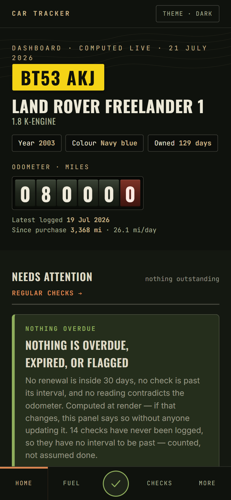

**On a phone**, a bar sits at the bottom with five slots:

- **Home** · **Fuel** — the two screens you touch most.
- **The centre slot** — a **＋** on any screen where you can add something (a fill, an expense, a reading), so
  the primary action is always under your thumb. On the **dashboard and checks** — screens with nothing single
  to "add" — it becomes a **status tell-tale** instead: a green ✓ when all is well, an amber/red warning
  triangle when a renewal is due, a check has lapsed, or a reading contradicts the odometer.
- **Checks** — the weekly walk-around.
- **More** — opens **All Screens**, every view grouped by how often you need it.

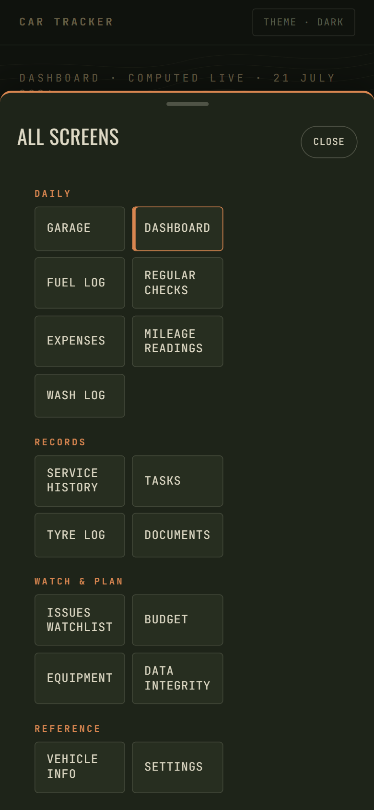

**On a desktop**, the same screens live along the top bar, with **More ▾** holding the rest.

Every screen is scoped to one vehicle; the plate (e.g. **BT53 AKJ**) is shown in the page header so you always
know whose history you're looking at.

---

## 2. The dashboard — what needs you today

The dashboard answers "is anything wrong, and what has this car cost me?" at a glance.

- **The dossier** — the identity block: make, model, year, the live odometer drum, days owned and miles/day.
- **Needs attention** — the panel that decides what the day is *for*. It raises only real alerts, worst-first:
  an expired or soon-due **MOT / insurance / road tax**, an **overdue check**, or a **reading that contradicts
  the odometer**. When there's nothing, it says so — and you can **Dismiss** that all-clear to tidy the screen.
  It comes back on its own the moment something genuinely needs attention.
- **Renewals & due dates** — MOT, insurance, road tax and next service, each with a live countdown and a status
  pill (OK / due soon / due / expired). The MOT date is **derived from your latest MOT record**, never typed.

  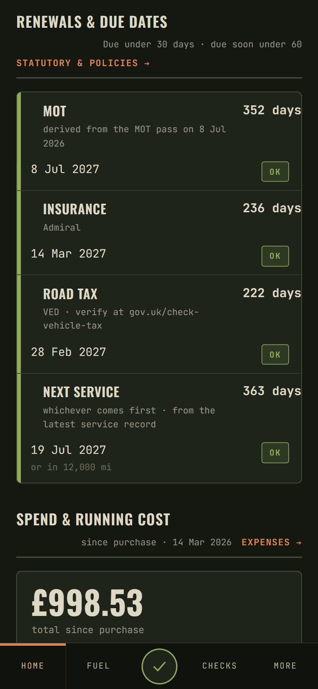

- **Spend & running cost**, **Fuel**, **Regular checks**, **Data integrity** — rollups that each link through to
  the full screen.

---

## 3. The daily loop — logging fuel, expenses, mileage

### Fuel

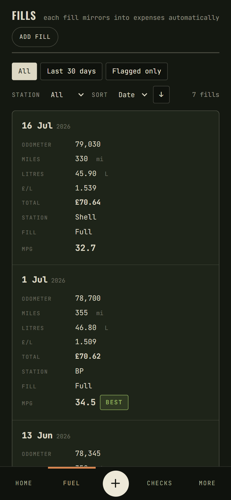

Tap **＋ / Add fill**, enter the date, odometer, litres, price and (optionally) the station. **MPG is computed
live as you type** from the distance since your last fill, so a mistyped odometer shows up as an absurd figure
before you save, not in a chart next week. Every fill also:

- writes an **odometer reading** into the mileage log, and
- **mirrors into expenses** automatically as a Fuel row — so the fuel total and the expense total can never
  disagree.

Fill level (Full / Half / Quarter) is recorded but **doesn't affect MPG** — litres are the whole basis. A figure
outside a plausible band is kept and flagged, never rejected.

### Expenses & mileage

**Expenses** works the same way — pick a category, an amount, an optional odometer reading. Fuel rows appear
here automatically marked **From fuel** and are read-only (you edit the fill, not its shadow). **Mileage** is the
spine every other log writes into; current mileage is always the **newest reading by date**, not the highest
number — so a mistyped 83,000 can never become your odometer.

---

## 4. Correcting and removing entries

Everything you log can be fixed or removed — a typo should never be permanent.

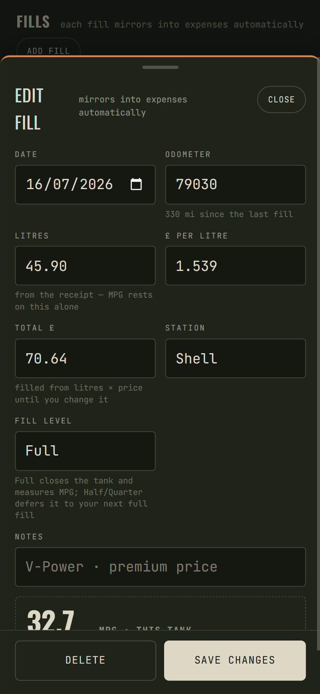

- **Tap any row** (fuel, expense, mileage, service, tyre, wash) to reopen it **seeded with its current values**.
- Change what's wrong and **Save**; the derived figures and any mirrored rows update with it.
- **Delete** sits in the sheet footer. It's a **two-step confirm** that names what goes with the entry
  ("Confirm delete — with its expense & reading"), because deleting a fill also removes its mileage reading and
  mirrored expense. One tap arms it, a second commits, and tapping away cancels.

Rows written by another log — a fuel-mirrored or service-mirrored expense, or a mileage reading that came from a
fill — are **read-only where they're shadows**; edit them at their source and the shadow follows.

---

## 5. Regular checks

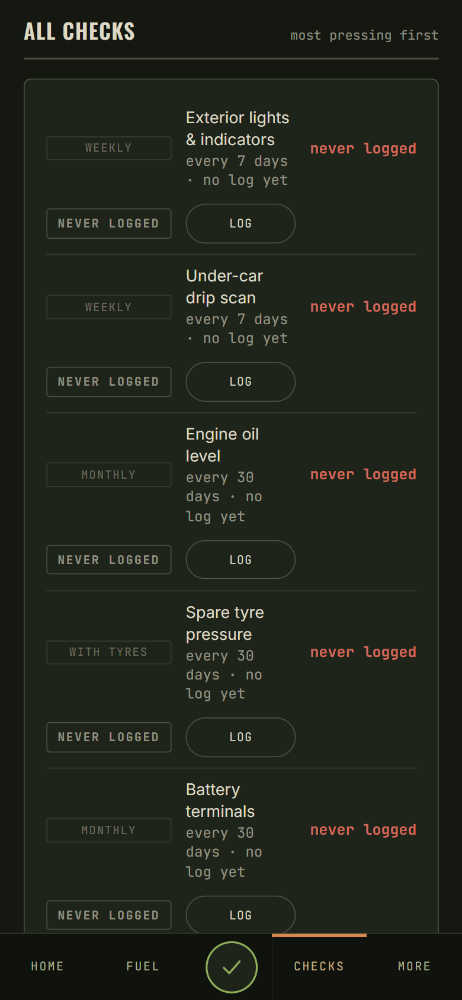

Each check has a cadence (weekly, monthly…), and its **status is computed** from its last log and that interval —
never stored. A check that has **never been logged** is its own state ("never logged"), not "OK" — the app won't
assume a job is done just because nothing says otherwise.

- **Log due** logs everything currently outstanding in one go (the weekly walk-around).
- **Log** on a single row logs just that one.
- The bottom-nav tell-tale shows green when nothing's due, amber/red when something is.

Add or edit the check definitions themselves in **Settings → Check definitions**, where each carries its cadence,
interval and active state.

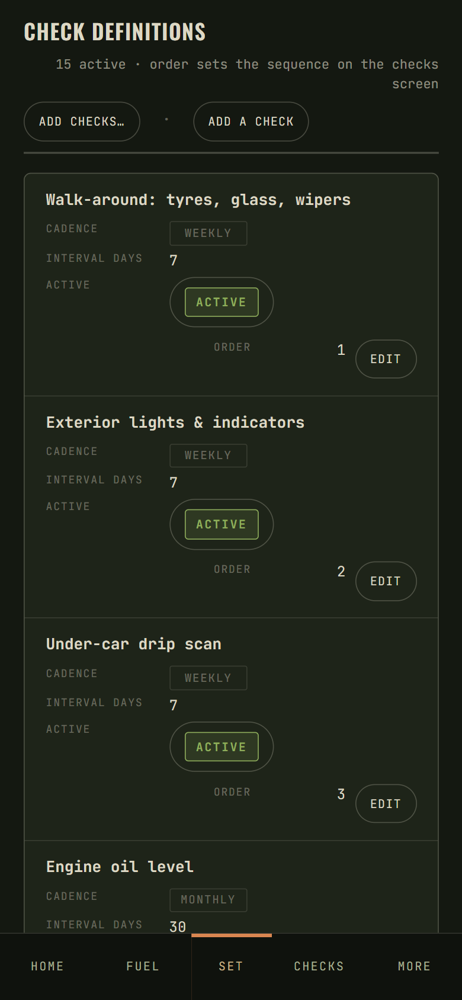

---

## 6. Service history & the MOT

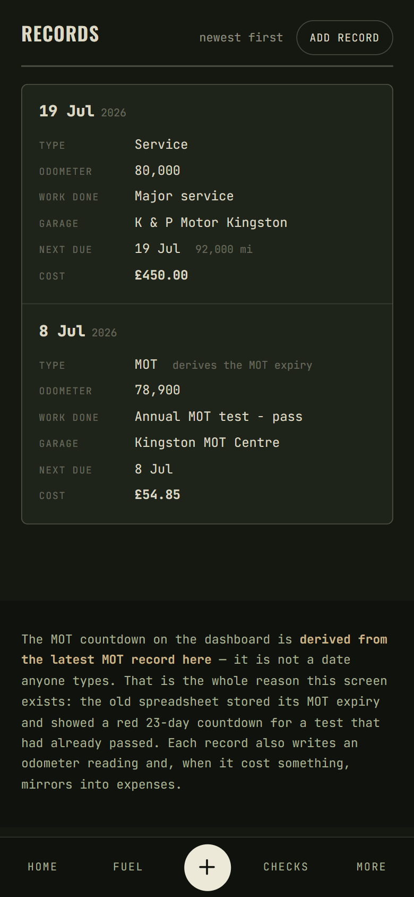

Log services, repairs and MOT tests here. Each record writes an odometer reading and — when it has a cost —
mirrors into expenses. **Choose "MOT" as the type** for an MOT pass and set its **next-due date**: the
dashboard's MOT countdown **derives from that record**. This is the heart of the app — the old spreadsheet
stored a copy of the MOT expiry and ended up showing a red 23-day countdown for a test that had already passed.
Here, log a newer pass and the countdown moves on its own.

---

## 7. Tyres, wash, tasks, issues, equipment

- **Tyres** — pressures and tread by corner (the spare included, the one that never gets checked). An optional
  odometer writes a reading.
- **Wash** — the log whose point is the **gaps**: it derives your wash cadence against a 3–4-week target, which
  on a salted road is a rust question, not a vanity one.
- **Tasks** — DIY and workshop jobs; workshop jobs can bundle into one garage visit with a summed cost.
- **Issues** — the watchlist: an observation you're *keeping an eye on* (advisory corrosion, a weep) with the
  decision made in advance for "if it worsens" — distinct from a task you intend to do.
- **Equipment** — the kit that lives with the car.

Each of these supports the same tap-to-edit and footer-delete as the daily logs.

---

## 8. Budget

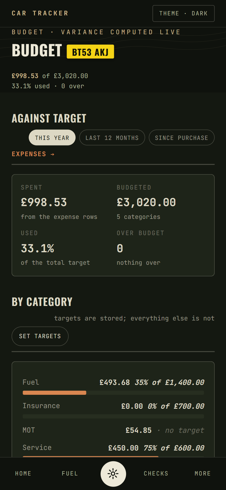

Set an annual target per category; the **actual is summed live** from your expenses and the variance is
highlighted. Toggle the period between **This year**, **Last 12 months** and **Since purchase** — the figures
recompute; nothing is stored.

---

## 9. Data integrity — the flags

When something you log contradicts the rest of the history — a mileage reading above the current odometer, an
implausible MPG, a receipt total that doesn't match litres × price — the app **flags it rather than silently
accepting or rejecting it**. The flag lands in the **Data integrity** queue, where you resolve it as:

- **Corrected** — it was a typo, now fixed. (If the condition comes back, so does the flag.)
- **Accepted** — "that really is what happened." It stays down.
- **Dismissed** — not worth pursuing.

And if you simply **delete the entry** behind a flag, the flag **auto-resolves itself** — the queue never points
at a row that no longer exists.

---

## 10. Settings & vehicle info

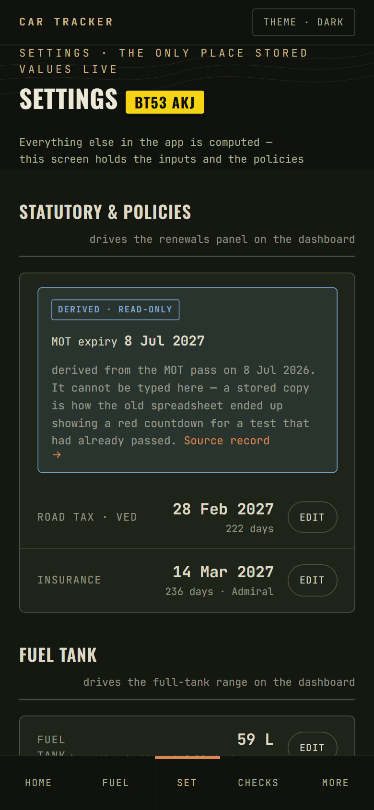

**Settings** holds the *stored inputs* the rest of the app computes from: statutory dates (road tax, the MOT
seed), the insurance policy, and the check definitions. Editing any of these **preloads the current values** —
change what you need and save. The MOT expiry is deliberately **not editable** here: it derives from your latest
MOT record, and a stored copy is exactly the drift this app exists to prevent.

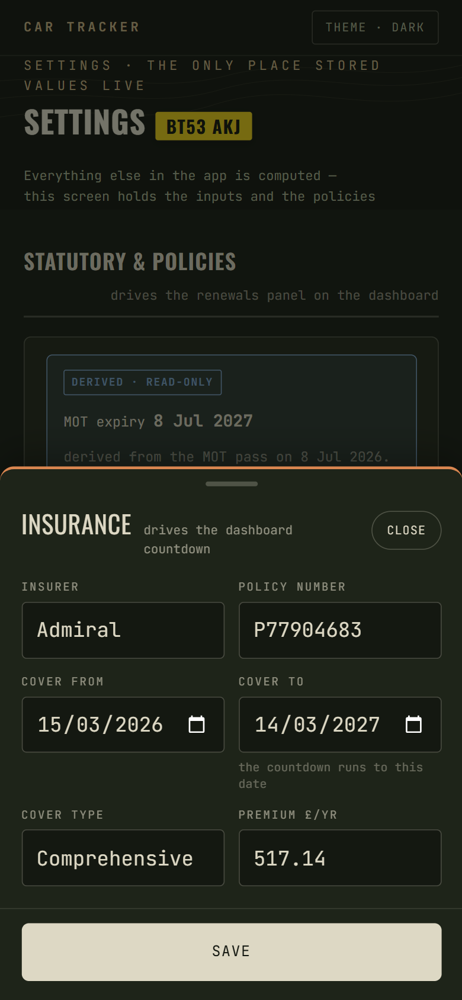

**Vehicle info** is the reference card — specs, fluids, tyre pressures — the one screen that is honestly stored,
because an oil spec is what the manual says, not something any log produces.

---

## Quick reference

| I want to… | Go to |
|---|---|
| Log a fill | Fuel · ＋ |
| Fix or delete an entry | Tap the row → edit / footer **Delete** |
| See what needs doing | Dashboard · **Needs attention** |
| Do the weekly checks | Checks · **Log due** |
| Log an MOT / service | Service · Add record (type **MOT**) |
| Set a budget | Budget · **Set targets** |
| Review a flagged figure | Data integrity |
| Update insurance / road tax | Settings · **Edit** |

---

*Screenshots referenced above live in [`screenshots/`](screenshots/). See that folder's `README.md` for the
list of captures and where each belongs.*
